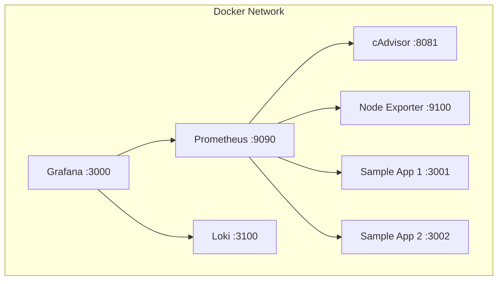

# Terraform Observability Stack

Grafana + Prometheus + Loki stack with Docker and sample Node.js apps.

## Architecture



## Components

- **Grafana**: Dashboards and visualization
- **Prometheus**: Metrics collection
- **Loki**: Log aggregation
- **cAdvisor**: Container metrics
- **Node Exporter**: System metrics
- **Sample Apps**: Generate metrics and logs

## Prerequisites

- Docker
- Terraform >= 1.0

## Quick Start

```bash
# Clone and setup
git clone <your-repo-url>
cd terraform-practice

# Configure
cp terraform.tfvars.example terraform.tfvars

# Deploy
terraform init
terraform apply
```

## Access URLs

- Grafana: http://localhost:3000 (admin/admin123)
- Prometheus: http://localhost:9090
- Loki: http://localhost:3100
- Sample App 1: http://localhost:3001
- Sample App 2: http://localhost:3002
- cAdvisor: http://localhost:8081

## Dashboards

Pre-configured dashboards show:
- Container CPU/memory usage
- Application request rates and errors
- Log exploration with Loki

## Configuration

Edit `terraform.tfvars` to customize:
- Network settings
- Grafana credentials
- Log levels
- Cache sizes

## GitHub Actions

Workflows for:
- `terraform-validate.yml` - Syntax validation
- `terraform-plan.yml` - PR plan generation
- `terraform-apply.yml` - Manual deployments
- `terraform-destroy.yml` - Cleanup

## Project Structure

```
terraform-practice/
├── .github/workflows/     # CI/CD workflows
├── config/               # App configurations
│   ├── prometheus/
│   ├── grafana/
│   └── loki/
├── modules/              # Terraform modules
│   ├── network/
│   ├── prometheus/
│   ├── grafana/
│   ├── loki/
│   └── sample-app/
├── main.tf
├── variables.tf
└── terraform.tfvars.example
```

## Troubleshooting

```bash
# Check logs
docker logs grafana
docker logs prometheus
docker logs loki

# Health checks
curl http://localhost:3000/api/health
curl http://localhost:9090/-/healthy
curl http://localhost:3100/ready

# Generate test load
for i in {1..50}; do curl http://localhost:3001/api/data; done
```

## Cleanup

```bash
terraform destroy
```
